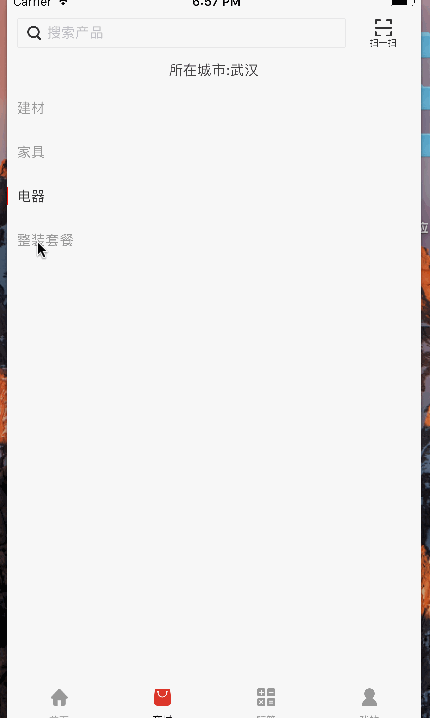

# kpengVerticalView
类似网易严选的竖着选择的列表

#pod 安装方式
pod 'kpengVerticalView', '~> 0.0.1'

#初始化方法和回调

  kpengVerticalView *listView =[[kpengVerticalView alloc] initWithFrame:XXView.bounds withTitle:self.categoryArray];
    
    [XXView addSubview:listView];
    
    listView.selectedInfoCallBack = ^(id callbackInfo) {
    
    NSLog(@"----%@",callbackInfo);
    
    };
   
   
 
